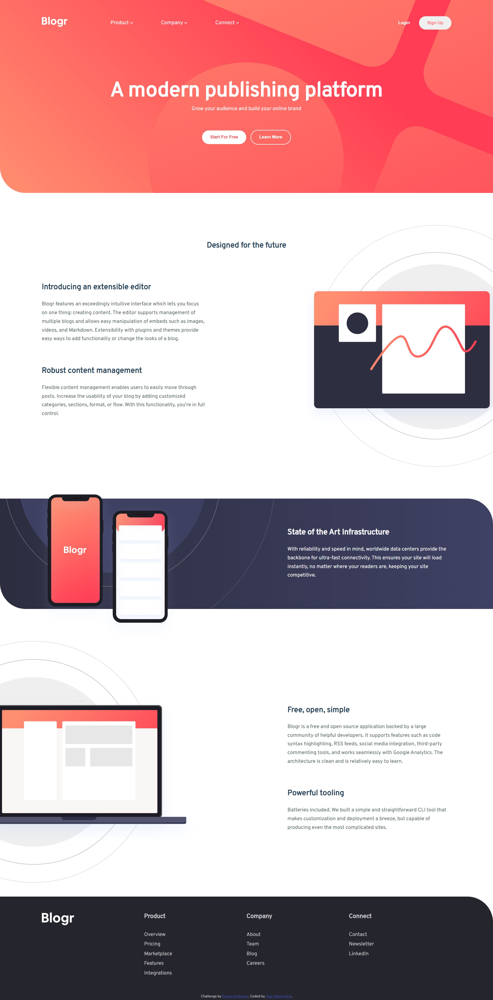
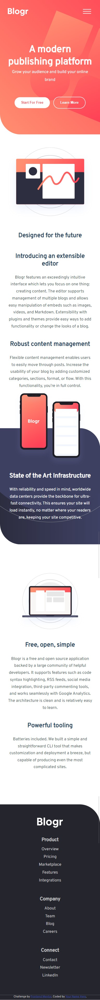

# Frontend Mentor - Blogr landing page solution

This is a solution to the [Blogr landing page challenge on Frontend Mentor](https://www.frontendmentor.io/challenges/blogr-landing-page-EX2RLAApP). Frontend Mentor challenges help you improve your coding skills by building realistic projects. 

## Table of contents

- [Overview](#overview)
  - [The challenge](#the-challenge)
  - [Screenshot](#screenshot)
  - [Links](#links)
- [My process](#my-process)
  - [Built with](#built-with)
  - [What I learned](#what-i-learned)
  - [Continued development](#continued-development)
  - [Useful resources](#useful-resources)

## Overview

### The challenge

Users should be able to:

- View the optimal layout for the site depending on their device's screen size
- See hover states for all interactive elements on the page

### Screenshot





### Links

- Solution URL: [Solution URL](https://github.com/K4UNG/project-2-blogr-landing-page)
- Live Site URL: [Live site URL](https://k4ung2.netlify.app/)

## My process

### Built with

- Semantic HTML5 markup
- CSS custom properties
- Flexbox
- CSS Grid
- JavaScript

### What I learned

This project turned out to be harder than I thought it would be. I only know very little JavaScript so I thought it would be challenging to build the navigation bar(I kinda cheated a bit by using css :focus selector). But placing background images turned out to be the hardest one and I learned alot about background-image property and absolute positioning.

For JavaScript, I wrote this to prevent mobile icons showing up even on the desktop viewport after the clicking events:

```js
window.onresize = ()=>{
    if (body.clientWidth > 840) {
      bar.style.display = "none";
      cross.style.display = "none";
      nav.style.opacity = "1";
      nav.style['pointer-events'] = "all";
    }
     else {
      cross.style.display = "none";
      bar.style.display = "unset";
      nav.style.opacity = "0";
      nav.style['pointer-events'] = "none";
     }
  }
}
```


### Continued development

I need to focus more on layouts and positioning for CSS and I also seriously need to start learning JavaScript properly.

### Useful resources

- [Google](https://www.google.com) - I didn't have any particular resources for this project. I just searched up whatever came up to me so I'd just say Google.
